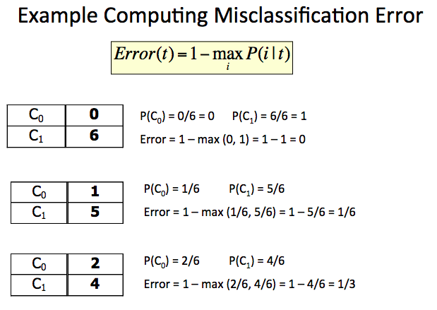
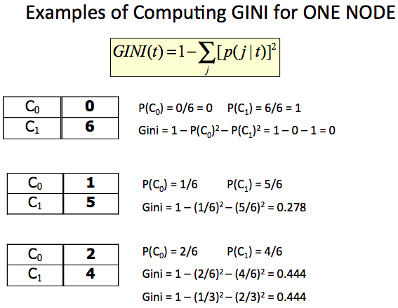
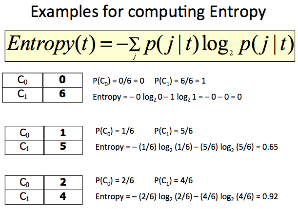
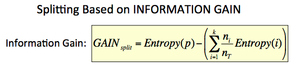
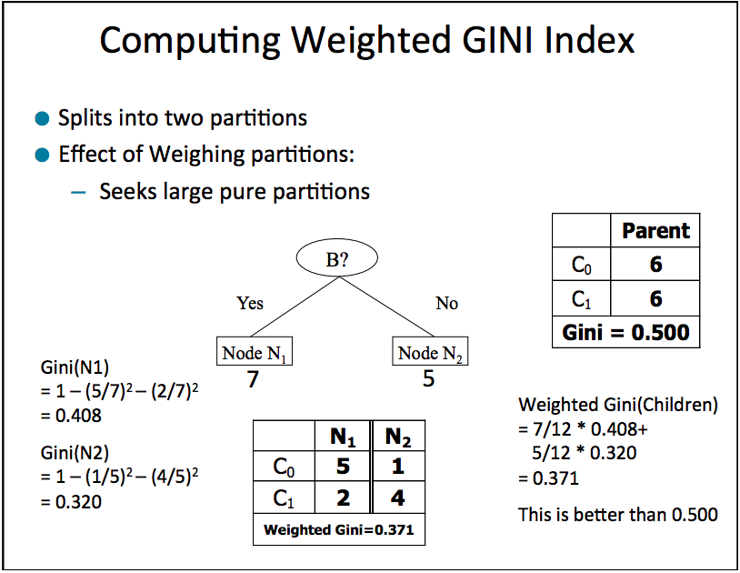
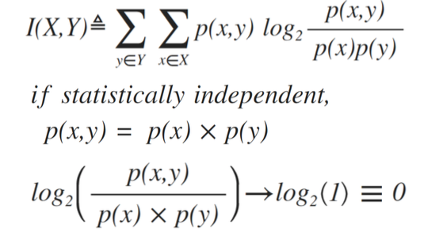

# Stuff from chapter 1 of book:
    * Scratchpad -- various temporary stuff.

Motivating Challenges:

* Scalability -
	datasets sizes are huge

* High Dimensionality - 
	rediculous number of columns for every row

* Heterogenous and complex data:
	eg. web pages, DNA data, time series data. 

* Distributed data:
	how to run KNN algo on dataset stored in 3 different places
	main challenge is to reduce the communication to achieve 
	consolidated result

* Non-traditional Analysis:
	traditional analysis involves - hypothesize and test it 
	Doing so in data mining is laborious

### The origins of Data mining:
To solve the challenges mentioned above, people from different fields like 
statistics, machine learning, AI and pattern recognition came together. 
----------------------------------------------------------------------------

# Tasks in DM:
Generally can be divided in two major categories

1. Predictive Tasks:
	predict the value of an attribute based on other attributes.
	Target variables, explanatory variables.
	
2. Descriptive Tasks:
	derive patterns that summarize the underlying relationship in data.
	Are often exploratory in nature.

3. Association analysis: is used to discover patterns that describe stronlgy associated features in the data. 

other types of tasks:
* Anamoly detection 
* Cluster analysis
	Finding structures in the dataset.

principles and techniques used in DM are introduced from an algorithmic prespective. 
----------------------------------------------------------------------------

Lect 2: 

# [[Terms]]:
## Handling outliers:
1. Ignoring them
2. Seperating them into a seperate special dataset
3. Replacing it with standard values (mean, median, mode)

## Mixture Model:
what is a mixture model ? 
link which explains the mixture model with book price modelling example. 

gist: if modelling book price which include paper back and hard back, its make much more sense to model the prices of these books seperately, instead of having 
just one distribution. 

https://stephens999.github.io/fiveMinuteStats/intro_to_mixture_models.html

### There are two types of mixture models:
1. Crisp : (black or white) Either pop corn is popped or no. (Value only be either of the two) {hmmmm! Sort of like classification ?}
2. Fuzzy : Popcorn can be 0% burned or 100% or any value in between.{Hmmmm! sort of like regression?}

----------------------------------------------------------------------------
Lect 3:

# Type of data: ([[NOIR]] - a french word which means dark)
## Categorical:
1. Nominal - classes, can only distinguish (Asssam, Bhutan)
2. Ordinal - has an order, can sort, can compare (shirt size)

## Numerical:
3. Interval - can substract (Shoe size ?) Difference between them gives information.
4. Ratio - contains absolute zero 

## Types of Dataset:
* Record Data - Market basket analysis
* Graph Data - Chemistry, Social network analysis
* Ordered Data - Time series data.

Data can be binary or continous, but not both ?
Binary is yes or no, Did I buy the milk (Yes or No )
Continous is how much or when, how much milk and when did I buy it.(Continous) 

> We consider different type of data because based on the type of data we can decide what sort of math (algorithm) we can run on it. (This should be question to the professor)

## Problems with Data
* Outlier 
* Missing values
* Inconsistent values
* Duplicate records

### Outlier: 
	they throw off computations, they are still valid values
### Missing values:
	Value which is simply missing
### Inconsistent values:
	wrong answer, some data points are house add some are zip code for the same column.
### Duplicate data:
	Must eliminate the redundancyy somehow 
Need to use a form deduplication (see definitation above)
### Dis-ambiguation: (distinguish records)
approaches:
	1. Switch to a different key 
	2. Combine the unique keys to make a new unique key

# what is Noise ?
	Any unwanted recorded data is NOISE. 
It is any unwanted crap that we have in our data. 
why do we call it NOISE, the term came from electronics field, when noise was added to the voice signal.

## Flavors of Noise:
1. Interference Noise: 
	True signal that comes from something else that you were not trying to record. (Sound of Fan of microwave, when popoing popcorn -- we only want sound of pop-corn popping and not the sound of fan)

2. Meaurement Noise: 
	Issues caused by making the recording. 

Noise reduction:
* Local average: sum of three neighbouring number and divide by the 3 to get local average.
* Running average: same as Local average

## Parzen Density estimation
	is a way to deal with noise.
Kernels:
1. Linear 
2. Triangular 
3. Gaussian

## Quantization methods:
1. Binning method:  (noise removal)

	bin_size  = 1.1

	q_w = floor(wt / bin_size) * bin_size

2. Otsu's method can be used for binary quantization.

## Bias
1. Unconsicious bias (All tall students are good students)
2. Systematic bias (doing round, ceil and floor function)

--------------------------------------------------------------------------------
Missed Lect 5 6 

Review :

# Few math formulas:
1. Equation of a line
	Ax + By + C = 0
2. Equation of a plane
	Ax + By + Cz + D = 0
3. Distance of a point from line  
p = [x0, y0] line = Ax + By + C =0
d = |Ax0 + By0 + C| / (np.sqrt(A ** 2 + B ** 2))
4. Distance of a point from plane  
d = |Ax0 + By0 + CZo| / (np.sqrt(A ** 2 + B ** 2 + C ** 2))
5. Dot product (x.y = |x| * |y| * cos(theta))
	x.y -> is element wise product of the x and y and then taking the magnitude.

		projection of an vector with other is also = to their dot product

--------------------------------------------------------------------------------
Lecture 8

# Classification:
Basic classification stuff, target variable, cost function which calculate a numeric value, minimize it. 

## Confusion matrix:
00.True positive: Fire and smoke detector did go off.

01.False Positive: think False alrams. There wasnt a fire and smoke detector went off (False positive).

10.False Negative: there was a fire but the smoke detector did not go off (Mis).

11.True Negative: No fire and fire alarm did not go off

* FPR:
	case	you	caught,	but	did	not	want	do	divided	by	
the	number	of	cases	you	never		want	to	catch.
  = FP / FP + TN

* FNR: False Negative Rate
	case	you	failed	to	catch	but	wanted	to		
divided	by	the	number	of	cases	you	could	have	
caught.	


--------------------------------------------------------------------------------
Lecture 9:

# Software Quality Asssurance. 
Software required for Ohio caucas failed. because it may not have been tested properly. 
So test your data product also make sure it works. Also have a back up plan. 
> I think professor wanted to introduce the concept of validation dataset.

--------------------------------------------------------------------------------
Lecture 10:
# ROC Curve
* Murphy's law: Whatever could go wrong on a jet engine will go wrong when its running at 50k RPM.

ROC curve tells us few things:
1. which classifier to use
2. What threshold to use

we want to select the threshold/classifier which is closest to the top left corner (TPR =1 , FPR = 0)

Some wage example of Bath tub curve.

Stressed about FP, TP, FN , TN.  they depend upon how you define your target variable. 
TODO: create a github gist and post the link  here.


## Other measures of how good the classifier is:
1. Accuracy = correct / total
2. Misclassification rate = incorrect / total
3. Precision
	All of the cases you said were true, what fraction were actually true.
TP / (TP + FP)
4. Recall same as TPR: TP / (TP + FN) 
5. Specificity = True nagative rate = TN / (TN + FP)

--------------------------------------------------------------------------------
Lecture 11:

#  [[Distancemetrics]]:
want low entropy, Bhattacharya cooefficient should be zero.
* Common distance metrics

Distance between ROC to Buffalo is 64miles.

But it could be something else.. 
how much coffee or food do you need ? 

*** Defining your own distance. 

D(overall) = w1 * distance + w2 * gas + w3 * time.

* similarity: how close two things are
* dissimilarity: how different two things are

## 3 ideal properties of Proper Distances:
1. Positivity 
2. Symmtery d(x,y) == d(y,x)
3. Triangular inequality 
	d(x,z) <= d(x,y) + d(y,z) 
	from x to any other point , and then from that point to point z.

## Promixity and Distance Metrics:
1. Euclidean distance (L2 norm) = np.sqrt(np.square(x - y))
2. Manhattan distance (l1 norm, city block distance)
3. Supremum distance (max norm) - not very useful, because its not comparable
4. the L0 norm: 
	with p=0, # of terms that differ.
5. the hamming distance - does not consider the length of the vector
6. minkowski distance (Lp Norm) 
7. Jaccard coefficient - Does not consider the 0 bits
8. Cosing similarity  - angle between two vectors, used in document similaritt NLP.
9. Correlation coefficient  
10. Mutual information- how much does the variable s tell you about the variable t.
11. Mahalanobis distance  - like Z-score but in n-dimensions.
12. Haversine distance - Distance between two points on earth (strecth a string)
13. Bhattacharya coeff - Is the similarity of 2 probability distributions, how hard is it to seperate one probability dis from other.
14. Levenshtein distance - Insert of a new character
15. Phychological distance - the distance to money

F00 -> x = 0 & y = 0

F01 -> x = 0 & y = 1

F10 -> x = 1 & y = 0

F11 -> x = 1 & y = 1

Hamming = (F10 + F01)

SMC = (F00 + F11) / (F00 + F01 + F10 + F11)

Jaccard = F11 / (F11 + F10 + F01)

## Z-score: Compare two 1-dimensional things(pd)
1. Substract the mean (this will shift the distribution to center the mean on the origin)
2. Divide by the standard deviation (this will scale the distribution)

> 68% of the datapoints lie within 2 standard deviation.

## Mahalanobis distance: like Z-score but in n-dimensions.
MAINLY used to determine outliers.

Contours- are like hills.
Intuition:
>calculate how hard(in distance) it is to climb the hill. 
If we use L2 norm, then it would simply give the distance of point from the peak. (does not work because the contour could be skewed)

So, rotate, transform and scale the contour to form a perfect circle and then take the euclidean distance (l2).
Does this by multiplying with the co-variance matrix.

## cross-correlation of attributes:
Measures the linear relationship between two variables using 
mu and sigma, mu is the mean and sigma is the standard diviation.

Nice intuition
> How well do these two attributes increase with each other?

>How much does one attribute increase when the other attribute decreases?

Unlike co-variance, correlation is limited to -1 to 1.
> How often, when the variable 's' is above its average, is the variables 't' also above its average?
----------------------------------------------------------------------
End of Mid term 1

# Data Cleaning:
## Missing Data:
* Build a simple classifier to fill in the missing value
* Fill in the most common value
* create a speial 'MISSING_CODE'
* Delete it
	1. That attribute
	2. That tuple
> Missing values or consistent values are resulted due to refusal to answer

## Racing throug the survey:
* Short time to complete the survey
* Obvious answers wrong
* Spelling mistakes / typing mistakes
* Always the 1st or the last answer

# Data Normalization:

1. Z-score:
	Maps to normal gaussian distribution
> refer how to calculate z-score

2. Dynamic ranging
* Find minvin(Value_in) -> find minimum from the input values 
* Find maxvin (Value_in) -> find maximum from the input values 
* Value_out = (Value_in - minvin)/(maxvin - minvin) {this restricts the value between 0 and 1}
* Value_out * (max(value_out) - min(value_out)) + min(Vout)

> barycentric point
> Unami taste sensor was discovered by Data Scientist

3. Zero centering
* Dyanamic ranging to the range[0,1]
* Substract by 1/2 (0.5)
* Multiply by 2

Used in Artifical Neural Network

4. Measuring chaos -> Measure of impurity in the dataset
	a. Entropy

	b. Gini Index4. Measuring chaos -> Measure of impurity in the dataset
a. Entropy


	b. Gini Index4. Measuring chaos -> Measure of impurity in the dataset
	a. Entropy


b. Gini Index4. Measuring chaos -> Measure of impurity in the dataset
a. Entropy


b. Gini Index


# N-Fold Cross validation


--------------------------------------------------------------------------------
# Decision Tree

* Occam's razor
> Given two models with similar accuracy prefer the simple  one
* No Free Lunch Theorem:
> No single model technique will work for all possible data, No type of model works for all scenarios.

* Induction: Build induced using traning data 
* Decude: make deductions about the other data

# Generic Decision Tree Induction
1. For a set of training records,
find the best attribute to use to divide the records into subsets
(Try all possible attributes) -- we need a measure of how good the current attribute in splitting the dataset.

2. Recursively sub-divide data into pure leaf nodes. (impurity = 0)

3. Stop when done.

## Whats the problem with generic decision tree algo:(Three Design decisions)
* how to decide the best attribute
* How to split on it
* how to decide when to stop 


### Computing Measures of Best: Minimize the Bad:
1. Minimize the mis-classification error
2. Minimize the weighted Gini Index of the resulting sub-sets
3. Minimize the weighted entropy of the resulting sub-sets
4. Maximize the gain raio - the decrease in entropy that comes from using a split 
5. Minimize the Bhattacharya Coefficient

* Minimize:
	1. Misclassification Error
	2. Gini Index
	3. Entropy
	4. Bhattacharya Coefficient
* Maximize:
	1. Information Gain
	2. Information Gain Ratio

* Misclassification Error: 
Missclassification error for one node
Error(t) = 1 - max(pi)








* Addressing Over-Fitting
* Pre-Pruning
* Post-Pruning

----------------------------------------------------------------------
# Naive Bayes

will define these terms:
* **prior probability** is the probability prior to putting any restriction or filter on the dataset. 

like if we have an attribute A1 which has values True / False, so prior probability would be how many times A1 is true in the entire dataset / total number of data points in the dataset, we did not consider any other attribute to calculate this probability. 
* **Likelihood** So when we consider label attribute to put filters like, how many times is A1 is true when label is true. this is called Likelihood. 

So when using Naive Bayes, this are the two terms(Prior Probabilty and Likelihood) we have to calculate from our dataset.

Based on these two calculated values we can calculate the **posterior probability** using Bayes rule. 

* **Conditional independence** : Naive Bayes assume that all the attributes in the dataset are independent of each other, hence the name naive for making such an assumption. 
So finally the formula for calculating posterior probability is. 

Two types of attributes. 
Catagorical 
Continuous. 

For continuous value we cannot use the same method we used to calculate likelihood and prior probability of the attribute. 

 
Whenever we hear Naive Bayes, we hear the **Bayes rule**. 
So lets understand the bayes rule first 
posterior probability also known as 
Bayes Theorem

`P(a|b) = P(b|a) * P(a) / P(b)`

it tell us how many time a happens given b happens
So the formula kind of tells us “forwards” when we know “backwards” (or vice versa)


Example: If dangerous fires are rare (1%) but smoke is fairly common (10%) due to factories, and 90% of dangerous fires make smoke then

	* P(fire) = 0.01
	* P(smoke) = 0.1
	* P(smoke|fire) = 0.9

	* P(Fire|Smoke) = P(smoke|fire) * p(fire) / p(smoke)
                = 0.9 * 0.01 = 
                9 / 100 * 1 / 100


----------------------------------------------------------------------
# Attribute and Feature Selection
Attribute and feature means the same thing

- Decision Boundary -> a line that seperates the data points in the dataset
- What is the relationship between decision boundary and a projection vector?
	They are orthogonal (perpendicular to each other)
- What would be a good initial Projection vector?
	The one joining the means of the two classes, as if we draw decision boundary it would be good initial decision boundary


* Feature selection is more important than the algorithm you use, its more important to do feature selection than comparing which ML algorithm to use. A well feature engineered dataset would perform better on any ML algorithm compared to non-feature engineered dataset.


- Too many attributes filutes the differences that we are looking for (this would get more clear if you look at Curse of dimensionality section)

- Constract is the key: 
- Idea is to have features in the dataset that are constrast to each other.

- Again only way to prove that a feature is helpful is to use it in a classifier, and use N fold cross Validation. 

## Two Steps of feature extraction:
1. Feature creation
	- Intuitive, may require domain Knowledge
	- PCA
2. Feature Selection
	- OF all ways of combining feautres, which ways help you find the thing you're looking for.
### Approaches for Feature Selection: 

#### Measures of Features
	Some measures help us guess if a feature might predict a target variable

##### Variance of the feature itself
How much does the feature changes, if all the value of a feature are same, like are you a human?, or all values are different like GUID, then such feature is of no value and can be rejected.

##### Mutual Information

- In theory, mutual information is the best method for single attribute selection
- Requires a lot of data
	- or need to estimate probability densities
	- or need to categorize continous variables
##### COvariance

##### Cross-Correlation
- Features which are highly cross-correlated are redundant

#### Selection
Combining groups of Attributes. How hard could this be?
- Given 12 inputs features, how many ways can they be combined for a learnig machine?
	- Answer, 4.2 Million ways
- 3 Basic feature selection Strategies
##### Filters
###### Forward Selection
Starting with no features, Progressively add to the set of features you want to use.
- Try each feature, and keep the best one.
- this is like a __greedy approach__
	- if given 10 feature, choose the one which gives maximum benefit
	- then repeat the process with one less feature

###### Backward Feature Rejection
Start with all the features and using greedy strategy remove the features which improves the final benefit.

###### Pick two, reject one 
Two steps of forward selection, and one step of backward elimination 
- this tends to "Shake up" the selected features

##### Wrappers
- Genetic programming

##### Embeded Method
DEcision Trees

## Closing
### Benefits od Feature Selection
* fewer features to measure
* less data to collect


* avoids curse of dimensionality


----------------------------------------------------------------------


# Principle Component Analysis

## Why PCA:
1. Data Pre-Processing/data rotation 
2. Identify most important and least important features
3. Dim reduction (cannot project back onto all of the Principle components, what does this mean?)
4. To reveal the shape of the 3D data


## Background Math

* Projection onto a vector

    Data = D = [Dx, Dy]
    V = [Vx, Vy] --> A normalized unit vector
    
    Projection amount = V.D

```Python 
def projection(Vector, Data):
    print(Vector.shape) # 2 * 3
    print(Data.shape) # 3 * 4
    projection_amt = np.dot(Vector, Data)
    print(projection_amt) # 2 * 3

```

> Projection gives you ONE amount of that vector

## Re-Projection 
If you multiply the amount of the projection back times the original unit vector, you get a position along the vector in space.


## Problems
* Points which are far from each other, may project to nearly similar points 
* Two different points can project onto the exact same point
* When projection, the new points are simplified, **but information is lost**


## Who Cares about PCA
* Projecting onto Fewer Dimensions
1. We can project data points on random unit vectors and create classifiers which use the projection amounts as features. ( such classifiers are equally good)
2. Think, projectin a data points with 12 dimension (*shape (1 * 12))* projected on random vector *(shape(1 * 12))* will result in a single value 1 * 1
3. Can use threshold classifier for classification
4. This is the advantage of dims reduction

## Instead of projecting on random unit vectors, can we use other non-random unit vectors on which we can project data points?
**Yes, use PCA and find such non random vectors on which you can project the data**

> so, projection of data on the vector is the technique which results in dim reduction, PCA helps in finding vectors on which the data should be projected for better results

```Python
def get_rotation_vector(theta):
    return np.array([math.cos(theta), -math.sin(theta), math.sin(theta), math.cos(theta)]).reshape(2, 2)
```

* Take a dataset, plot it, rotate the data so the entire data can be explained by just one feature (ideally ) , the problem is to find by how much should the data be rotated. 

## It find the direction of maximum variation of the data given to it
* It does not know anything about the classes
* Is not prefect, but helpful

## The Eigenvalues relate to how much variation the associate eigen vector contains

## Eigenvectors
PCA involves computing Eigenvectors ( In German, it means proper vector)
* They are the vectors that explain:
    1. The direction of the most variation in the data
    2. The next direction of most of the rest of the variation in the data
    3. These form an orithoginal set of basis vectors to descrive data with

> you project your features on to EigenVector, (so you can say that eigenvectors are the ratation vector, meaning they tell you to rotate the data by that much (eigenvector) so that the features are widely spread)
> It is in the direction of the maximum variation 


1. **Find the direction of maximum variation of the data**
    1. Take the eigenvectors of the covariance matrix of the data
    2. Using the relative eigenvalues (normalized), find the eigenvectors that explain 95% of the variance of the data

2. Apply the Karhunen-Loeve Transform
    1. Substract the mean 
    2. Use the first eigenvector (the direction of the maximum variance)
    3. Rotate the data by the angle of the maximum variation so that it is axially aligned
    

M = np.array([0.971, -0.566, -0.566, 0.729]).reshape(2,2) 

* M is the Covariance matrix

[[ 0.971, -0.566],

 [-0.566,  0.729]]
 

 # Linear Differentiation Analysis (LDA)
Given two sets of data, ClassA and ClassB, we can estimate a good projection vector for them using a process calld Linear Discriminant Analysis, or the Fisher Linear Discriminant. 

> It is a formula using Linear Algebra

* To get there, we must make some assumptions, but this is often a good guess at the best projection vector

## PCA vs LDA
* PCA is unsupervised (we never look at the labels), LDA is supervised
* PCA trap
    * as PCA is unsupervised, for n dims it provides n eigenvectors, which one would be the best (try and find out) is known. 
* as LDA is supervised, it usually tells which projection vector to choose


## FLD Classifier
It is a mathematical formula

`W = SW^-1(m1-m2)`

## Assumptions of FLD
1. The data is distributed as multi-demensional Gaussian
2. The covariances of both classes are the same
3. The data is linearly seperable
4. Balanced: the Two classes have the same number of sample

## 2 ways to think about FLD
1. **Correct**, it is a vector, on which the data should be projected on, so that a line can be drawn perpendicular to it that best seperates the data. 
> Remember, decision boundary and projection vector are orthogonal. 

## FLD is always a vector
The FLD is the vector that you project the data on to.

* Once you project onto the vector, how many dims do you have for your data? **Only one, this is the key**.

* The Decision boundary though is always perpendicular to the Projection vector is not always a line, 
in 2 d is a line, in 3 d is plane, N-d Hyperplane

* It tries to maximize an objective function
    * Minimize within-class (intra-class) scatter
    * Maximize the between-class (inter-class) scatter
